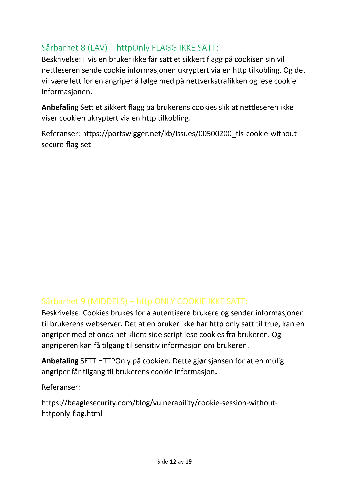

# Vulnerability Assessment Report (in Norwegian)

This repository contains a comprehensive penetration test report conducted on a vulnerable system. The report is written in Norwegian and includes detailed findings of various vulnerabilities discovered during the assessment. The identified vulnerabilities include Cross-Site Scripting, SQL Injection, exposure of unencrypted HTTP traffic, outdated software versions, and several other security weaknesses. Each vulnerability is thoroughly documented in the report, providing insights and recommendations for mitigation.

Please note that the full report is written in Norwegian.

# Report

